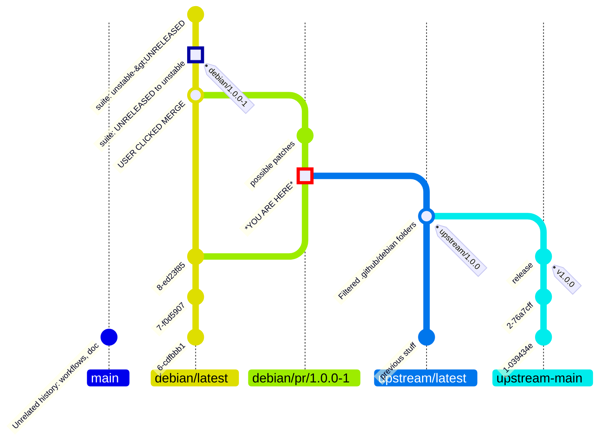

<!-- Diagram for debian/latest branch (unrelated history) -->

```mermaid
---
config:
  themeVariables:
    'gitInv2': '#ff0000'
  gitGraph:
    parallelCommits: true
    rotateCommitLabel: true
---
gitGraph BT:
    
    branch debian/latest   order: 1
    branch upstream-main order: 4
    branch upstream/latest order: 3

    checkout main
    commit id: "Unrelated history: workflows, doc"


    checkout upstream-main
    commit
    checkout upstream-main
    commit
    commit id: "release" tag: "v1.0.0"

    checkout upstream/latest
    commit id: "previous stuff"
    merge upstream-main id: "Filtered .github/debian folders" tag: "upstream/1.0.0"

    checkout debian/latest
    commit
    commit
    commit

    branch debian/pr/1.0.0-1 order: 2
    merge upstream/latest id: "*YOU ARE HERE*" type: HIGHLIGHT
    commit id: "possible patches"

    checkout debian/latest
    merge debian/pr/1.0.0-1 id: "USER CLICKED MERGE"
    commit id: "suite: UNRELEASED to unstable" type: HIGHLIGHT tag: "debian/1.0.0-1"
    commit id: "suite: unstable->UNRELEASED"
    
```