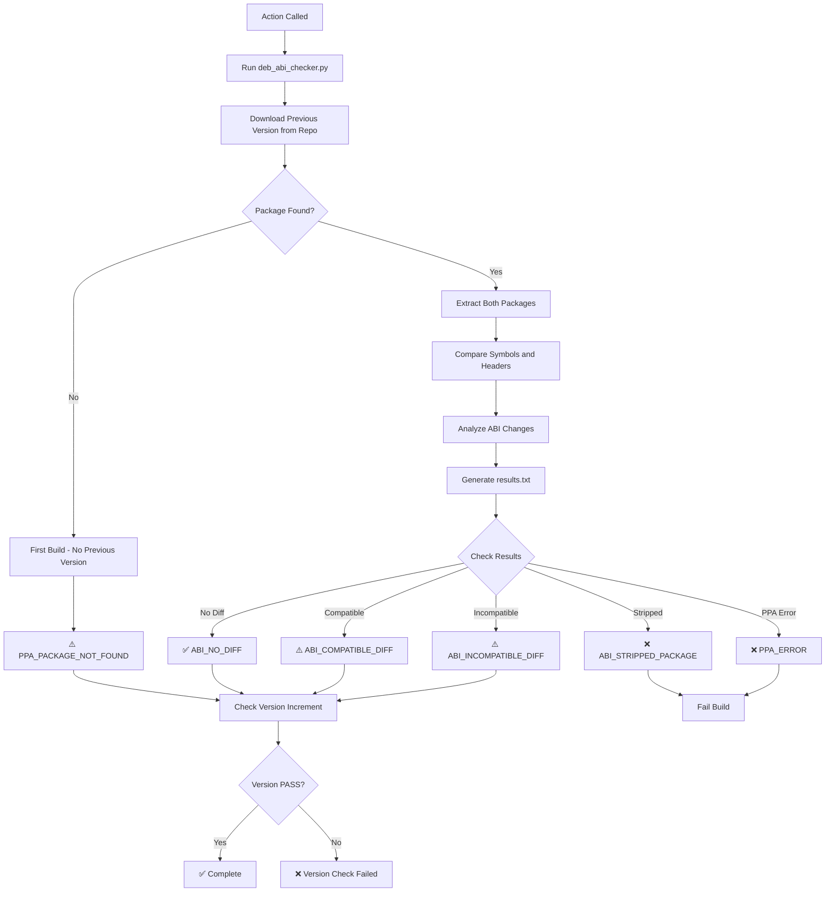

# abi_checker

**Path**: `.github/actions/abi_checker/action.yml`

**Purpose**: Checks the Application Binary Interface (ABI) compatibility of a newly built package against the previous version in the repository. This helps prevent unintentional API/ABI breakage.

## Inputs

| Input | Required | Default | Description |
|-------|----------|---------|-------------|
| `distro-codename` | Yes | - | Distribution codename (noble, jammy, etc.) |

## Environment Variables Required

- `REPO_URL`: APT repository URL to download previous package version
- `BUILT_PACKAGE_NAME`: Name of the built package (set by previous steps)

## Process Flow



## Return Codes

The ABI checker returns a bitmask of results:

| Bit | Value | Code | Meaning |
|-----|-------|------|---------|
| - | 0 | `RETURN_ABI_NO_DIFF` | No ABI differences detected |
| 0 | 1 | `RETURN_ABI_COMPATIBLE_DIFF` | ABI changed but compatible |
| 1 | 2 | `RETURN_ABI_INCOMPATIBLE_DIFF` | ABI changed incompatibly |
| 2 | 4 | `RETURN_ABI_STRIPPED_PACKAGE` | Package is stripped (error) |
| 3 | 8 | `RETURN_PPA_PACKAGE_NOT_FOUND` | No previous version found |
| 4 | 16 | `RETURN_PPA_ERROR` | Repository access error |

## Failure Conditions

The action **fails** the build if:

1. **Stripped Package** (bit 2 set): Package has no debug symbols - cannot verify ABI
2. **PPA Error** (bit 4 set): Unable to access the repository
3. **Version Not Incremented**: New version is not greater than repository version

## Warning Conditions

The action **warns** but continues if:

1. **Compatible Diff** (bit 0 set): ABI changed but backward compatible
2. **Incompatible Diff** (bit 1 set): ABI changed incompatibly (should increment version)
3. **No Previous Package** (bit 3 set): First build of this package

## ABI Comparison Details

The checker analyzes:

- **Exported symbols**: Functions and variables in shared libraries
- **Symbol versions**: Version information attached to symbols
- **Header files**: Public API definitions (for -dev packages)
- **SONAME**: Shared object version naming

## Version Check

After ABI checking, verifies that:

- New package version > Repository version (for updates)
- Version increment is appropriate for ABI changes:
  - Major version: Incompatible changes
  - Minor version: Compatible additions
  - Patch version: Bug fixes only

## Usage Example

```yaml
- name: Run ABI Check
  uses: ./qcom-build-utils/.github/actions/abi_checker
  with:
    distro-codename: noble
```

## Notes

- Requires `build-area/` directory with built packages
- Creates `results.txt` with detailed analysis
- Does not fail on ABI differences, only on fatal errors
- Intended to inform developers, not block builds automatically
