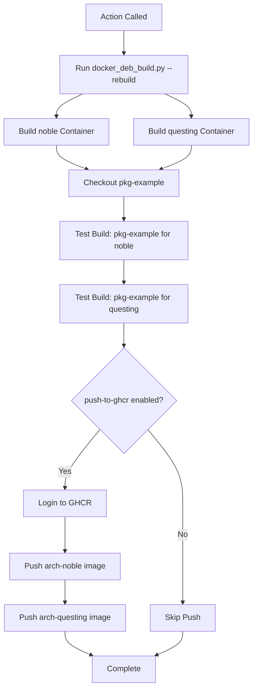

# build_container

**Path**: `.github/actions/build_container/action.yml`

**Purpose**: Builds Docker container images used for Debian package compilation. These containers include all necessary build tools and dependencies.

## Inputs

| Input | Required | Default | Description |
|-------|----------|---------|-------------|
| `arch` | Yes | - | Architecture to build for (`amd64` or `arm64`) |
| `push-to-ghcr` | No | `true` | Whether to push built image to GitHub Container Registry |
| `token` | Yes | - | GitHub PAT for registry authentication |
| `username` | Yes | - | Username for registry authentication |

## Environment Variables Required

- `QCOM_ORG_NAME`: Organization name (typically `qualcomm-linux`)
- `IMAGE_NAME`: Base image name (typically `pkg-builder`)

## Process Flow



## Container Images Built

For each architecture, two images are built:

- `ghcr.io/qualcomm-linux/pkg-builder:{arch}-noble`
- `ghcr.io/qualcomm-linux/pkg-builder:{arch}-questing`

## Build Process

1. **Rebuild containers**: Uses `docker_deb_build.py --rebuild` to build from Dockerfiles
2. **Checkout test package**: Clones `pkg-example` repository
3. **Test noble build**: Builds example package for Ubuntu 24.04 (noble)
4. **Test questing build**: Builds example package for Ubuntu 25.04 (questing)
5. **Push to registry**: Uploads images to GHCR (if enabled)

## Container Contents

Each container includes:

- **Base OS**: Ubuntu (noble or questing)
- **Build tools**: 
  - `sbuild` - Schroot-based package builder
  - `git-buildpackage` (gbp) - Debian package build tool
  - `dpkg-dev` - Debian package development tools
  - `devscripts` - Debian developer scripts
  - `lintian` - Debian package quality checker
- **Cross-compilation** (amd64 images):
  - ARM64 cross-compilation toolchain
  - QEMU for ARM64 emulation
- **Utilities**:
  - Git, wget, curl
  - Python for build scripts

## Image Tags

Images use the format:
```
ghcr.io/{org}/{name}:{arch}-{distro}
```

Examples:
- `ghcr.io/qualcomm-linux/pkg-builder:amd64-noble`
- `ghcr.io/qualcomm-linux/pkg-builder:arm64-noble`
- `ghcr.io/qualcomm-linux/pkg-builder:amd64-questing`
- `ghcr.io/qualcomm-linux/pkg-builder:arm64-questing`

## Testing Strategy

Before pushing to GHCR, the action validates containers by:

1. Building `pkg-example` package in each container
2. Verifying build succeeds for both noble and questing
3. Only pushing if both test builds succeed

This ensures published containers are functional.

## Usage Example

```yaml
- name: Build Container Images
  uses: ./.github/actions/build_container
  with:
    arch: arm64
    push-to-ghcr: true
    token: ${{ secrets.DEB_PKG_BOT_CI_TOKEN }}
    username: ${{ vars.DEB_PKG_BOT_CI_USERNAME }}
```

## Notes

- Built images are cached by Docker for faster subsequent builds
- `pkg-example` must build successfully before images are pushed
- Images are only pushed on non-PR events (push to main, schedule, manual)
- ARM64 images are built on self-hosted ARM64 runners for reliability
- Cross-compilation using buildx was attempted but had QEMU issues
