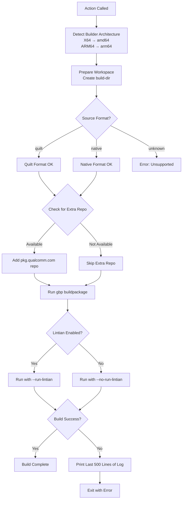

# build_package

**Path**: `.github/actions/build_package/action.yml`

**Purpose**: Builds a Debian package using git-buildpackage (gbp) and sbuild. This action handles both native and cross-compilation builds.

## Inputs

| Input | Required | Default | Description |
|-------|----------|---------|-------------|
| `distro-codename` | Yes | - | Ubuntu distribution codename (noble, questing, jammy, etc.) |
| `pkg-dir` | Yes | - | Directory containing the Debian package source |
| `build-dir` | Yes | - | Directory where build artifacts will be placed |
| `run-lintian` | No | `false` | Whether to run lintian quality checks |

## Process Flow



## Build Architecture Logic

The action determines the build configuration based on the runner architecture:

| Runner Arch | BUILD_ARCH | HOST_ARCH | Build Type |
|-------------|------------|-----------|------------|
| X64 (amd64) | amd64 | arm64 | Cross-compile |
| ARM64 | arm64 | arm64 | Native build |

## Build Command

The action runs git-buildpackage with sbuild:

```bash
gbp buildpackage \
  --git-ignore-branch \
  --git-builder="sbuild --host=arm64 \
                        --build=${BUILD_ARCH} \
                        --dist=${distro-codename} \
                        ${lintian_flag} \
                        --build-dir ../${build-dir} \
                        --build-dep-resolver=apt \
                        ${EXTRA_REPO}"
```

## Key Features

- **Cross-compilation support**: Can build ARM64 packages on x86_64 hosts
- **Native builds**: Can build ARM64 packages on ARM64 hosts (faster)
- **Chroot isolation**: Uses sbuild with unshare mode for clean builds
- **Extra repository**: Automatically adds internal Qualcomm repo if available
- **Error handling**: Prints build log tail on failure for debugging
- **Source format detection**: Supports both quilt and native formats

## Build Artifacts

After successful build, the following artifacts are created in `build-dir`:

- `*.deb` - Binary package files
- `*.ddeb` - Debug symbol packages
- `*.changes` - Package change description
- `*.buildinfo` - Build environment information
- `*.build` - Build log
- `*.dsc` - Debian source control file (for non-native)
- Source archives (for non-native packages)

## Usage Example

```yaml
- name: Build Debian Package
  uses: ./qcom-build-utils/.github/actions/build_package
  with:
    distro-codename: noble
    pkg-dir: package-repo
    build-dir: build-area
    run-lintian: true
```
