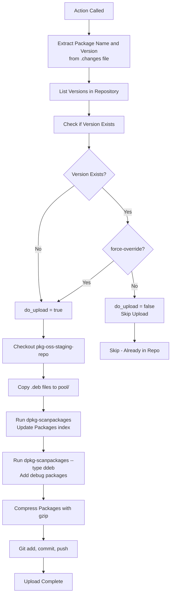

# push_to_repo

**Path**: `.github/actions/push_to_repo/action.yml`

**Purpose**: Uploads built Debian packages to the staging APT repository if they don't already exist. Handles repository metadata updates.

## Inputs

| Input | Required | Default | Description |
|-------|----------|---------|-------------|
| `distro-codename` | Yes | - | Distribution codename (noble, jammy, etc.) |
| `token` | Yes | - | GitHub PAT for repository access |
| `force-override` | No | `false` | Override package if version already exists |

## Environment Variables Required

- `REPO_URL`: APT repository URL
- `REPO_NAME`: GitHub repository name (e.g., `qualcomm-linux/pkg-oss-staging-repo`)

## Process Flow



## Repository Structure

Packages are organized as:

```
pkg-oss-staging-repo/
├── pool/
│   └── {distro}/
│       └── stable/
│           └── main/
│               ├── package_1.0-1_arm64.deb
│               ├── package_1.0-1_arm64.ddeb
│               └── ...
└── dists/
    └── {distro}/
        └── stable/
            └── main/
                └── binary-arm64/
                    ├── Packages
                    └── Packages.gz
```

## Package Index Generation

The action generates APT metadata:

1. **Scan binary packages**: `dpkg-scanpackages --multiversion pool/{distro}`
2. **Scan debug packages**: `dpkg-scanpackages --type ddeb --multiversion pool/{distro}`
3. **Combine and compress**: Create `Packages` and `Packages.gz`

## Upload Process

1. **Extract metadata** from `.changes` file:
   - Package name (first non-dev binary)
   - Version number

2. **Check repository**:
   - Query if version already exists
   - Decide whether to upload

3. **Clone repository**:
   - Shallow clone of `pkg-oss-staging-repo`

4. **Copy packages**:
   - Use `ppa_organizer.py` to copy `.deb` and `.ddeb` files

5. **Update metadata**:
   - Regenerate `Packages` index
   - Compress with gzip

6. **Commit and push**:
   - Git commit with descriptive message
   - Push to repository

## Commit Message Format

```
Uploaded Package {PACKAGE_NAME} at version {VERSION} for distro {DISTRO}
```

## Usage Example

```yaml
- name: Push to Repository
  uses: ./qcom-build-utils/.github/actions/push_to_repo
  with:
    distro-codename: noble
    force-override: false
    token: ${{secrets.TOKEN}}
```

## Notes

- Only pushes if version doesn't exist (unless `force-override: true`)
- Handles both binary (`.deb`) and debug (`.ddeb`) packages
- Automatically updates APT repository metadata
- Uses bot credentials for git commits
- Repository is immediately available after push (GitHub Pages)
