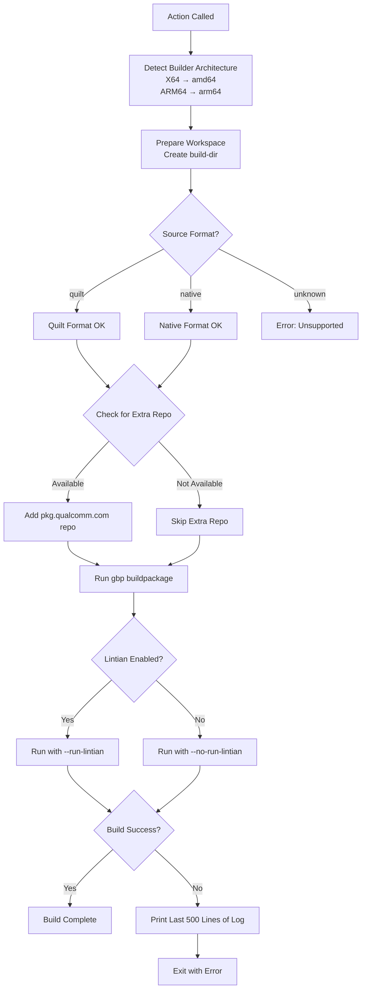
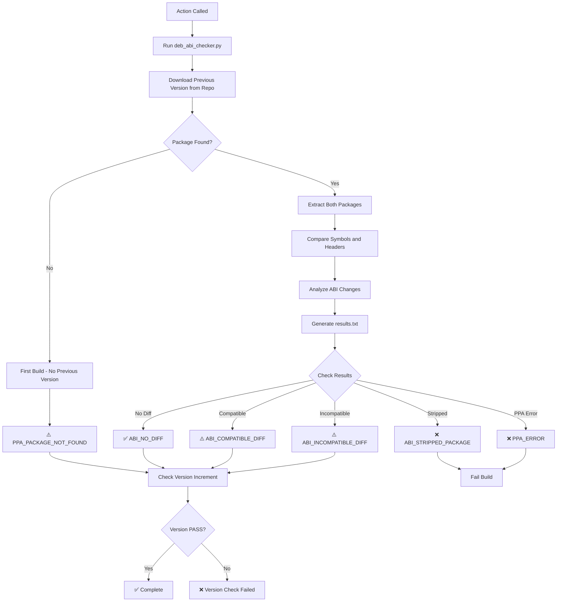
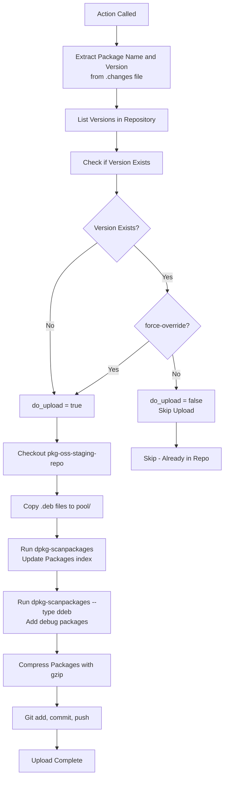
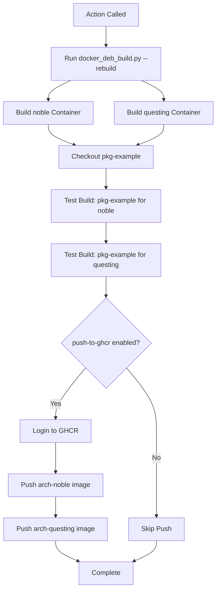
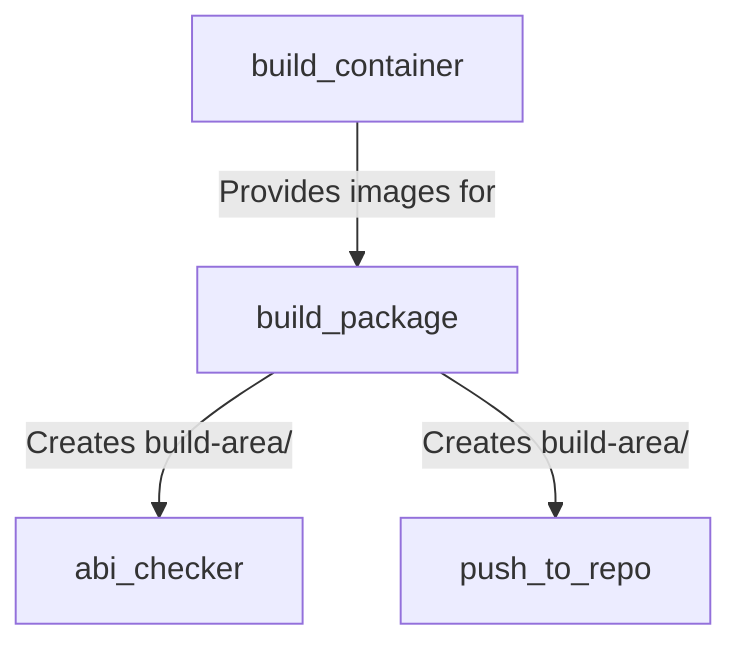

# GitHub Actions

This document describes the composite GitHub Actions used by the reusable workflows in qcom-build-utils.

## Overview

Composite actions are reusable units of workflow steps defined in `.github/actions/`. They encapsulate common functionality that can be shared across multiple workflows.

## Available Actions

1. [build_package](#build_package)
2. [abi_checker](#abi_checker)
3. [push_to_repo](#push_to_repo)
4. [build_container](#build_container)

---

## build_package

**Path**: `.github/actions/build_package/action.yml`

**Purpose**: Builds a Debian package using git-buildpackage (gbp) and sbuild. This action handles both native and cross-compilation builds.

### Inputs

| Input | Required | Default | Description |
|-------|----------|---------|-------------|
| `distro-codename` | Yes | - | Ubuntu distribution codename (noble, questing, jammy, etc.) |
| `pkg-dir` | Yes | - | Directory containing the Debian package source |
| `build-dir` | Yes | - | Directory where build artifacts will be placed |
| `run-lintian` | No | `false` | Whether to run lintian quality checks |

### Process Flow



### Build Architecture Logic

The action determines the build configuration based on the runner architecture:

| Runner Arch | BUILD_ARCH | HOST_ARCH | Build Type |
|-------------|------------|-----------|------------|
| X64 (amd64) | amd64 | arm64 | Cross-compile |
| ARM64 | arm64 | arm64 | Native build |

### Build Command

The action runs git-buildpackage with sbuild:

```bash
gbp buildpackage \
  --git-ignore-branch \
  --git-builder="sbuild --host=arm64 \
                        --build=${BUILD_ARCH} \
                        --dist=${distro-codename} \
                        ${lintian_flag} \
                        --build-dir ../${build-dir} \
                        --build-dep-resolver=apt \
                        ${EXTRA_REPO}"
```

### Key Features

- **Cross-compilation support**: Can build ARM64 packages on x86_64 hosts
- **Native builds**: Can build ARM64 packages on ARM64 hosts (faster)
- **Chroot isolation**: Uses sbuild with unshare mode for clean builds
- **Extra repository**: Automatically adds internal Qualcomm repo if available
- **Error handling**: Prints build log tail on failure for debugging
- **Source format detection**: Supports both quilt and native formats

### Build Artifacts

After successful build, the following artifacts are created in `build-dir`:

- `*.deb` - Binary package files
- `*.ddeb` - Debug symbol packages
- `*.changes` - Package change description
- `*.buildinfo` - Build environment information
- `*.build` - Build log
- `*.dsc` - Debian source control file (for non-native)
- Source archives (for non-native packages)

### Usage Example

```yaml
- name: Build Debian Package
  uses: ./qcom-build-utils/.github/actions/build_package
  with:
    distro-codename: noble
    pkg-dir: package-repo
    build-dir: build-area
    run-lintian: true
```

---

## abi_checker

**Path**: `.github/actions/abi_checker/action.yml`

**Purpose**: Checks the Application Binary Interface (ABI) compatibility of a newly built package against the previous version in the repository. This helps prevent unintentional API/ABI breakage.

### Inputs

| Input | Required | Default | Description |
|-------|----------|---------|-------------|
| `distro-codename` | Yes | - | Distribution codename (noble, jammy, etc.) |

### Environment Variables Required

- `REPO_URL`: APT repository URL to download previous package version
- `BUILT_PACKAGE_NAME`: Name of the built package (set by previous steps)

### Process Flow



### Return Codes

The ABI checker returns a bitmask of results:

| Bit | Value | Code | Meaning |
|-----|-------|------|---------|
| - | 0 | `RETURN_ABI_NO_DIFF` | No ABI differences detected |
| 0 | 1 | `RETURN_ABI_COMPATIBLE_DIFF` | ABI changed but compatible |
| 1 | 2 | `RETURN_ABI_INCOMPATIBLE_DIFF` | ABI changed incompatibly |
| 2 | 4 | `RETURN_ABI_STRIPPED_PACKAGE` | Package is stripped (error) |
| 3 | 8 | `RETURN_PPA_PACKAGE_NOT_FOUND` | No previous version found |
| 4 | 16 | `RETURN_PPA_ERROR` | Repository access error |

### Failure Conditions

The action **fails** the build if:

1. **Stripped Package** (bit 2 set): Package has no debug symbols - cannot verify ABI
2. **PPA Error** (bit 4 set): Unable to access the repository
3. **Version Not Incremented**: New version is not greater than repository version

### Warning Conditions

The action **warns** but continues if:

1. **Compatible Diff** (bit 0 set): ABI changed but backward compatible
2. **Incompatible Diff** (bit 1 set): ABI changed incompatibly (should increment version)
3. **No Previous Package** (bit 3 set): First build of this package

### ABI Comparison Details

The checker analyzes:

- **Exported symbols**: Functions and variables in shared libraries
- **Symbol versions**: Version information attached to symbols
- **Header files**: Public API definitions (for -dev packages)
- **SONAME**: Shared object version naming

### Version Check

After ABI checking, verifies that:

- New package version > Repository version (for updates)
- Version increment is appropriate for ABI changes:
  - Major version: Incompatible changes
  - Minor version: Compatible additions
  - Patch version: Bug fixes only

### Usage Example

```yaml
- name: Run ABI Check
  uses: ./qcom-build-utils/.github/actions/abi_checker
  with:
    distro-codename: noble
```

### Notes

- Requires `build-area/` directory with built packages
- Creates `results.txt` with detailed analysis
- Does not fail on ABI differences, only on fatal errors
- Intended to inform developers, not block builds automatically

---

## push_to_repo

**Path**: `.github/actions/push_to_repo/action.yml`

**Purpose**: Uploads built Debian packages to the staging APT repository if they don't already exist. Handles repository metadata updates.

### Inputs

| Input | Required | Default | Description |
|-------|----------|---------|-------------|
| `distro-codename` | Yes | - | Distribution codename (noble, jammy, etc.) |
| `token` | Yes | - | GitHub PAT for repository access |
| `force-override` | No | `false` | Override package if version already exists |

### Environment Variables Required

- `REPO_URL`: APT repository URL
- `REPO_NAME`: GitHub repository name (e.g., `qualcomm-linux/pkg-oss-staging-repo`)

### Process Flow



### Repository Structure

Packages are organized as:

```
pkg-oss-staging-repo/
├── pool/
│   └── {distro}/
│       └── stable/
│           └── main/
│               ├── package_1.0-1_arm64.deb
│               ├── package_1.0-1_arm64.ddeb
│               └── ...
└── dists/
    └── {distro}/
        └── stable/
            └── main/
                └── binary-arm64/
                    ├── Packages
                    └── Packages.gz
```

### Package Index Generation

The action generates APT metadata:

1. **Scan binary packages**: `dpkg-scanpackages --multiversion pool/{distro}`
2. **Scan debug packages**: `dpkg-scanpackages --type ddeb --multiversion pool/{distro}`
3. **Combine and compress**: Create `Packages` and `Packages.gz`

### Upload Process

1. **Extract metadata** from `.changes` file:
   - Package name (first non-dev binary)
   - Version number

2. **Check repository**:
   - Query if version already exists
   - Decide whether to upload

3. **Clone repository**:
   - Shallow clone of `pkg-oss-staging-repo`

4. **Copy packages**:
   - Use `ppa_organizer.py` to copy `.deb` and `.ddeb` files

5. **Update metadata**:
   - Regenerate `Packages` index
   - Compress with gzip

6. **Commit and push**:
   - Git commit with descriptive message
   - Push to repository

### Commit Message Format

```
Uploaded Package {PACKAGE_NAME} at version {VERSION} for distro {DISTRO}
```

### Usage Example

```yaml
- name: Push to Repository
  uses: ./qcom-build-utils/.github/actions/push_to_repo
  with:
    distro-codename: noble
    force-override: false
    token: ${{secrets.TOKEN}}
```

### Notes

- Only pushes if version doesn't exist (unless `force-override: true`)
- Handles both binary (`.deb`) and debug (`.ddeb`) packages
- Automatically updates APT repository metadata
- Uses bot credentials for git commits
- Repository is immediately available after push (GitHub Pages)

---

## build_container

**Path**: `.github/actions/build_container/action.yml`

**Purpose**: Builds Docker container images used for Debian package compilation. These containers include all necessary build tools and dependencies.

### Inputs

| Input | Required | Default | Description |
|-------|----------|---------|-------------|
| `arch` | Yes | - | Architecture to build for (`amd64` or `arm64`) |
| `push-to-ghcr` | No | `true` | Whether to push built image to GitHub Container Registry |
| `token` | Yes | - | GitHub PAT for registry authentication |
| `username` | Yes | - | Username for registry authentication |

### Environment Variables Required

- `QCOM_ORG_NAME`: Organization name (typically `qualcomm-linux`)
- `IMAGE_NAME`: Base image name (typically `pkg-builder`)

### Process Flow



### Container Images Built

For each architecture, two images are built:

- `ghcr.io/qualcomm-linux/pkg-builder:{arch}-noble`
- `ghcr.io/qualcomm-linux/pkg-builder:{arch}-questing`

### Build Process

1. **Rebuild containers**: Uses `docker_deb_build.py --rebuild` to build from Dockerfiles
2. **Checkout test package**: Clones `pkg-example` repository
3. **Test noble build**: Builds example package for Ubuntu 24.04 (noble)
4. **Test questing build**: Builds example package for Ubuntu 25.04 (questing)
5. **Push to registry**: Uploads images to GHCR (if enabled)

### Container Contents

Each container includes:

- **Base OS**: Ubuntu (noble or questing)
- **Build tools**: 
  - `sbuild` - Schroot-based package builder
  - `git-buildpackage` (gbp) - Debian package build tool
  - `dpkg-dev` - Debian package development tools
  - `devscripts` - Debian developer scripts
  - `lintian` - Debian package quality checker
- **Cross-compilation** (amd64 images):
  - ARM64 cross-compilation toolchain
  - QEMU for ARM64 emulation
- **Utilities**:
  - Git, wget, curl
  - Python for build scripts

### Image Tags

Images use the format:
```
ghcr.io/{org}/{name}:{arch}-{distro}
```

Examples:
- `ghcr.io/qualcomm-linux/pkg-builder:amd64-noble`
- `ghcr.io/qualcomm-linux/pkg-builder:arm64-noble`
- `ghcr.io/qualcomm-linux/pkg-builder:amd64-questing`
- `ghcr.io/qualcomm-linux/pkg-builder:arm64-questing`

### Testing Strategy

Before pushing to GHCR, the action validates containers by:

1. Building `pkg-example` package in each container
2. Verifying build succeeds for both noble and questing
3. Only pushing if both test builds succeed

This ensures published containers are functional.

### Usage Example

```yaml
- name: Build Container Images
  uses: ./.github/actions/build_container
  with:
    arch: arm64
    push-to-ghcr: true
    token: ${{ secrets.DEB_PKG_BOT_CI_TOKEN }}
    username: ${{ vars.DEB_PKG_BOT_CI_USERNAME }}
```

### Notes

- Built images are cached by Docker for faster subsequent builds
- `pkg-example` must build successfully before images are pushed
- Images are only pushed on non-PR events (push to main, schedule, manual)
- ARM64 images are built on self-hosted ARM64 runners for reliability
- Cross-compilation using buildx was attempted but had QEMU issues

---

## Common Patterns

### Action Location

All actions are referenced relative to the qcom-build-utils checkout:

```yaml
uses: ./qcom-build-utils/.github/actions/{action_name}
```

### Error Handling

Actions use consistent error handling:

```bash
set +e  # Allow commands to fail
command_that_might_fail
RET=$?
set -e  # Re-enable exit on error

if (( RET != 0 )); then
  echo "❌ Error occurred"
  exit 1
fi
```

### Output Indicators

Actions use emoji for clear status indication:

- ✅ Success
- ❌ Fatal error
- ⚠️ Warning
- ℹ️ Information

### Privileges

Actions that use containers require:

```yaml
container:
  options: --privileged
```

This is needed for:
- sbuild chroot operations
- Mount operations
- Namespace manipulation

## Dependencies Between Actions



### Typical Action Sequence

In a workflow:

1. `build_container` (if rebuilding containers)
2. `build_package` (builds the package)
3. `abi_checker` (checks ABI compatibility)
4. `push_to_repo` (uploads to repository)

## Best Practices

1. **Always run ABI checker**: Prevents accidental API/ABI breakage
2. **Test before pushing**: Use `push-to-repo: false` in pre-merge
3. **Rebuild containers weekly**: Keep build environment up-to-date
4. **Check build logs**: Review failures in detail using build log output
5. **Version semantics**: Follow semantic versioning based on ABI changes

## Debugging Actions

### Enable Debug Logging

Set repository secret:
```
ACTIONS_STEP_DEBUG = true
```

### Check Build Logs

For `build_package` failures:
```bash
# Look in build-area/ for .build file
tail -n 500 build-area/*.build
```

### Inspect Containers

Run container locally:
```bash
docker run -it --rm \
  ghcr.io/qualcomm-linux/pkg-builder:arm64-noble \
  /bin/bash
```

### Test Actions Locally

Use `act` tool to test GitHub Actions locally:
```bash
act -j job-name
```
