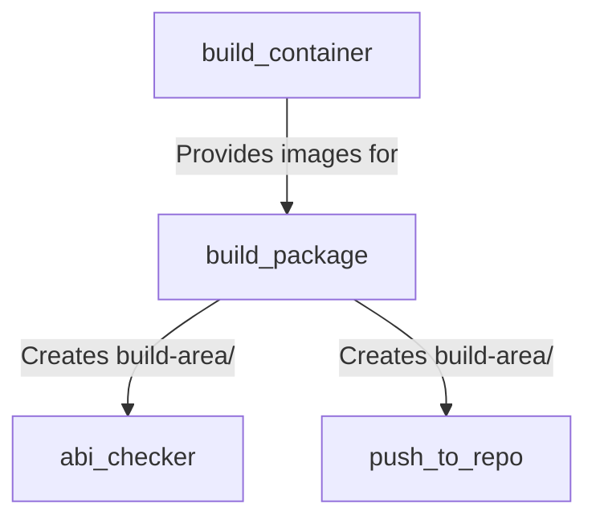

# GitHub Actions

This document provides an overview of the composite GitHub Actions used by the reusable workflows in qcom-build-utils.

## Overview

Composite actions are reusable units of workflow steps defined in `.github/actions/`. They encapsulate common functionality that can be shared across multiple workflows.

## Available Actions

The qcom-build-utils repository provides four main composite actions:

1. **[build_package](./actions/build_package.md)** - Builds Debian packages using git-buildpackage and sbuild
2. **[abi_checker](./actions/abi_checker.md)** - Checks ABI compatibility against previous package versions
3. **[push_to_repo](./actions/push_to_repo.md)** - Uploads built packages to the staging APT repository
4. **[build_container](./actions/build_container.md)** - Builds and tests Docker container images for package compilation

## Quick Reference

| Action | Purpose | Key Features |
|--------|---------|--------------|
| [build_package](./actions/build_package.md) | Build Debian packages | Cross-compilation, native builds, lintian checks |
| [abi_checker](./actions/abi_checker.md) | ABI compatibility validation | Symbol comparison, version checking |
| [push_to_repo](./actions/push_to_repo.md) | Repository publishing | Metadata updates, version deduplication |
| [build_container](./actions/build_container.md) | Container image building | Multi-arch support, automated testing |

## Common Patterns

### Action Location

All actions are referenced relative to the qcom-build-utils checkout:

```yaml
uses: ./qcom-build-utils/.github/actions/{action_name}
```

### Error Handling

Actions use consistent error handling:

```bash
set +e  # Allow commands to fail
command_that_might_fail
RET=$?
set -e  # Re-enable exit on error

if (( RET != 0 )); then
  echo "❌ Error occurred"
  exit 1
fi
```

### Output Indicators

Actions use emoji for clear status indication:

- ✅ Success
- ❌ Fatal error
- ⚠️ Warning
- ℹ️ Information

### Privileges

Actions that use containers require:

```yaml
container:
  options: --privileged
```

This is needed for:
- sbuild chroot operations
- Mount operations
- Namespace manipulation

## Dependencies Between Actions



### Typical Action Sequence

In a workflow:

1. `build_container` (if rebuilding containers)
2. `build_package` (builds the package)
3. `abi_checker` (checks ABI compatibility)
4. `push_to_repo` (uploads to repository)

## Best Practices

1. **Always run ABI checker**: Prevents accidental API/ABI breakage
2. **Test before pushing**: Use `push-to-repo: false` in pre-merge
3. **Rebuild containers weekly**: Keep build environment up-to-date
4. **Check build logs**: Review failures in detail using build log output
5. **Version semantics**: Follow semantic versioning based on ABI changes

## Debugging Actions

### Enable Debug Logging

Set repository secret:
```
ACTIONS_STEP_DEBUG = true
```

### Check Build Logs

For `build_package` failures:
```bash
# Look in build-area/ for .build file
tail -n 500 build-area/*.build
```

### Inspect Containers

Run container locally:
```bash
docker run -it --rm \
  ghcr.io/qualcomm-linux/pkg-builder:arm64-noble \
  /bin/bash
```

### Test Actions Locally

Use `act` tool to test GitHub Actions locally:
```bash
act -j job-name
```

## See Also

- [Workflow Architecture](./workflow-architecture.md) - Overall system architecture
- [Reusable Workflows](./reusable-workflows.md) - Workflows that use these actions
- [Package Repository Integration](./package-repo-integration.md) - How to use workflows in your package repository
