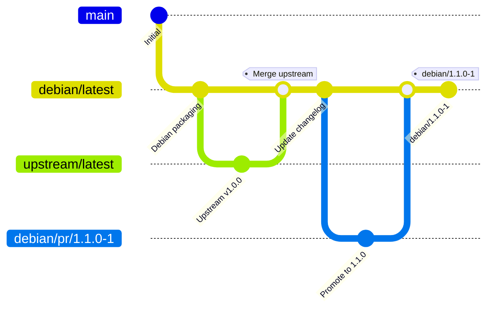
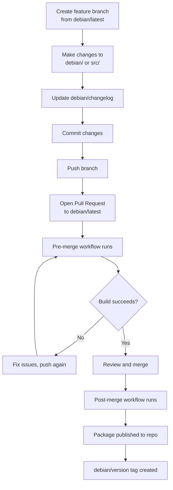
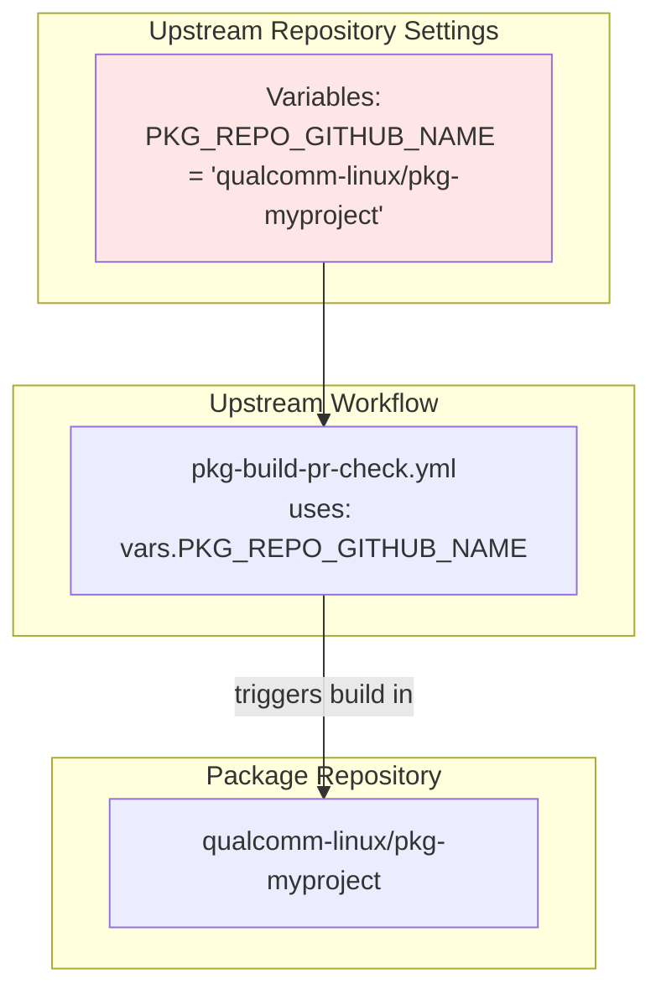
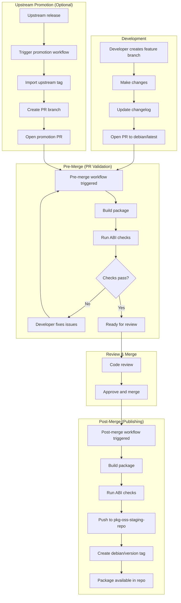

# Package Repository Integration

This guide explains how to integrate qcom-build-utils workflows into your Debian package repository.

## Overview

Package repositories (conventionally named with `pkg-` prefix) are Debian packaging repositories that follow the git-buildpackage structure. They contain Debian control files and minimal workflow files that call the reusable workflows from qcom-build-utils.

## Quick Start

The fastest way to get started is to use the [pkg-template](https://github.com/qualcomm-linux/pkg-template) repository:

1. Go to https://github.com/qualcomm-linux/pkg-template
2. Click "Use this template" → "Create a new repository"
3. Name your repository with the `pkg-` prefix
4. Customize the template files for your package
5. Follow the [workflow usage](#workflow-usage) section to start developing

For a complete working example, see [pkg-example](https://github.com/qualcomm-linux/pkg-example).

## Repository Structure

A typical package repository has the following structure:

```
pkg-mypackage/
├── .github/
│   └── workflows/
│       ├── pre-merge.yml        # PR validation
│       └── post-merge.yml       # Build and publish
├── debian/
│   ├── changelog                # Package version history
│   ├── control                  # Package metadata
│   ├── rules                    # Build instructions
│   ├── copyright                # License information
│   ├── source/
│   │   └── format              # Source package format
│   └── ...                      # Other debian files
├── src/                         # Source code (for native packages)
├── include/                     # Headers (if applicable)
└── README.md
```

## Git Branch Structure

Package repositories use a specific branch structure:



### Branch Descriptions

| Branch | Purpose | Protected |
|--------|---------|-----------|
| `main` | Primary development branch | Yes |
| `debian/latest` | Latest Debian packaging branch | Yes |
| `debian/<version>` | Version-specific branches (created from tags) | No |
| `debian/pr/<version>` | PR branches for version promotions | No |
| `upstream/latest` | Latest upstream source (non-native packages) | No |
| `upstream/<version>` | Tagged upstream versions | No |

## Setting Up Your Package Repository

### Quick Start with Template

The easiest way to create a new package repository is to use the [pkg-template](https://github.com/qualcomm-linux/pkg-template) repository as a starting point:

1. **Navigate to the template repository**: Go to https://github.com/qualcomm-linux/pkg-template
2. **Click "Use this template"**: Click the green "Use this template" button
3. **Create your repository**: 
   - Choose "qualcomm-linux" as the owner
   - Name your repository with the `pkg-` prefix (e.g., `pkg-mypackage`)
   - Add a description
   - Click "Create repository"

The template includes:
- Pre-configured workflow files (`.github/workflows/pre-merge.yml` and `post-merge.yml`)
- Basic Debian packaging structure (`debian/` directory with example files)
- Proper source format configuration

After creating from the template, you'll need to customize the files for your specific package.

### Manual Setup (Alternative)

If you prefer to set up a repository manually instead of using the template:

#### Step 1: Repository Setup

1. **Create repository** with `pkg-` prefix:
   ```bash
   gh repo create qualcomm-linux/pkg-mypackage
   ```

2. **Set up branch protection** for `debian/latest`:
   - Require pull request reviews
   - Require status checks to pass
   - Require branches to be up to date

3. **Configure organization secrets** (already set at org level):
   - `DEB_PKG_BOT_CI_TOKEN` - GitHub PAT
   - `SEMGREP_APP_TOKEN` - For security scanning

4. **Configure organization variables** (already set at org level):
   - `DEB_PKG_BOT_CI_USERNAME`
   - `DEB_PKG_BOT_CI_NAME`
   - `DEB_PKG_BOT_CI_EMAIL`

#### Step 2: Create Debian Packaging Files

> **Note**: If you used the pkg-template, these files are already included. You'll need to customize them for your package.

Create the standard Debian packaging structure:

```bash
mkdir -p debian/source
```

#### debian/control

```debian
Source: mypackage
Section: misc
Priority: optional
Maintainer: Your Name <your.email@qualcomm.com>
Build-Depends: debhelper-compat (= 13),
               cmake,
               pkg-config
Standards-Version: 4.6.2
Homepage: https://github.com/qualcomm-linux/mypackage

Package: mypackage
Architecture: arm64
Depends: ${shlibs:Depends}, ${misc:Depends}
Description: My package short description
 Long description of what the package does.
 Can span multiple lines.
```

#### debian/changelog

```debian
mypackage (1.0.0-1) noble; urgency=medium

  * Initial release

 -- Your Name <your.email@qualcomm.com>  Mon, 13 Nov 2024 10:00:00 +0000
```

#### debian/rules

```makefile
#!/usr/bin/make -f

%:
	dh $@
```

Make it executable:
```bash
chmod +x debian/rules
```

#### debian/source/format

For native packages:
```
3.0 (native)
```

For non-native (upstream tracking) packages:
```
3.0 (quilt)
```

#### debian/copyright

Follow the Debian copyright format. See example in pkg-example.

#### Step 3: Create Workflow Files

> **Note**: If you used the pkg-template, workflow files are already included and ready to use.

Create the minimal workflow files that call qcom-build-utils reusable workflows.

#### .github/workflows/pre-merge.yml

```yaml
name: Pre-Merge
description: |
  Tests that with this PR, the package builds successfully.

on:
  pull_request_target:
    branches: [ debian/latest ]

permissions:
  contents: read
  security-events: write

jobs:
  build:
    uses: qualcomm-linux/qcom-build-utils/.github/workflows/qcom-build-pkg-reusable-workflow.yml@development
    with:
      qcom-build-utils-ref: development
      debian-ref: ${{github.head_ref}}
      run-abi-checker: true
      push-to-repo: false
      is-post-merge: false

    secrets:
      TOKEN: ${{secrets.DEB_PKG_BOT_CI_TOKEN}}
```

#### .github/workflows/post-merge.yml

```yaml
name: Post-Merge
description: |
  Test that debian/latest builds after the merge. Once the build passes, push the new version to the staging repo

on:
  push:
    branches: [ debian/latest ]

permissions:
  contents: read
  security-events: write

jobs:
  build:
    uses: qualcomm-linux/qcom-build-utils/.github/workflows/qcom-build-pkg-reusable-workflow.yml@development
    with:
      qcom-build-utils-ref: development
      debian-ref: debian/latest
      push-to-repo: true
      run-abi-checker: true
      is-post-merge: true

    secrets:
      TOKEN: ${{secrets.DEB_PKG_BOT_CI_TOKEN}}
```

#### Step 4: Initial Commit

> **Note**: If you created your repository from pkg-template, the initial structure is already in place. You should customize the files and then commit your changes.

1. Create `debian/latest` branch:
   ```bash
   git checkout -b debian/latest
   ```

2. Commit all files:
   ```bash
   git add .
   git commit -s -m "Initial Debian packaging"
   ```

3. Push to remote:
   ```bash
   git push origin debian/latest
   ```

## Workflow Usage

### Making Changes

The typical workflow for making changes:



### Step-by-Step Process

#### 1. Create Feature Branch

```bash
git checkout debian/latest
git pull
git checkout -b fix/my-change
```

#### 2. Make Your Changes

Edit source code, Debian files, etc.

#### 3. Update Changelog

```bash
export DEBFULLNAME="Your Name"
export DEBEMAIL="your.email@qualcomm.com"

gbp dch --debian-branch=debian/latest --new-version=1.0.1-1 --distribution=noble
```

Or manually edit `debian/changelog`:

```debian
mypackage (1.0.1-1) noble; urgency=medium

  * Fix important bug
  * Add new feature

 -- Your Name <your.email@qualcomm.com>  Tue, 14 Nov 2024 10:00:00 +0000
```

#### 4. Commit and Push

```bash
git add .
git commit -s -m "Fix important bug"
git push origin fix/my-change
```

#### 5. Create Pull Request

```bash
gh pr create --base debian/latest --title "Fix important bug"
```

#### 6. Wait for Pre-merge Checks

The pre-merge workflow will:
- Build the package
- Run ABI compatibility checks
- Report results on the PR

#### 7. Merge Pull Request

Once approved and checks pass:

```bash
gh pr merge --squash
```

#### 8. Post-merge Automation

The post-merge workflow will:
- Build the package
- Run ABI checks
- Push to `pkg-oss-staging-repo`
- Create `debian/1.0.1-1` tag

## Advanced Workflows

### For Non-Native Packages (Tracking Upstream)

If your package tracks an upstream repository, you'll use additional workflows.

#### debian/watch

Create a `debian/watch` file to track upstream releases:

```
version=4
opts=filenamemangle=s/.+\/v?(\d\S+)\.tar\.gz/mypackage-$1\.tar\.gz/ \
  https://github.com/upstream-org/upstream-repo/tags .*/v?(\d\S+)\.tar\.gz
```

#### Upstream Promotion Workflow

Create `.github/workflows/promote-upstream.yml`:

```yaml
name: Promote Upstream Version

on:
  workflow_dispatch:
    inputs:
      upstream-tag:
        description: 'Upstream tag to promote (e.g., v1.2.0)'
        required: true
      upstream-repo:
        description: 'Upstream repository (e.g., org/repo)'
        required: true

permissions:
  contents: write

jobs:
  promote:
    uses: qualcomm-linux/qcom-build-utils/.github/workflows/qcom-promote-upstream-reusable-workflow.yml@development
    with:
      qcom-build-utils-ref: development
      upstream-tag: ${{ github.event.inputs.upstream-tag }}
      upstream-repo: ${{ github.event.inputs.upstream-repo }}
      promote-changelog: true
    secrets:
      TOKEN: ${{secrets.DEB_PKG_BOT_CI_TOKEN}}
```

#### Triggering Upstream Promotion

```bash
gh workflow run promote-upstream.yml \
  -f upstream-tag=v2.0.0 \
  -f upstream-repo=upstream-org/upstream-repo
```

This will:
1. Fetch the upstream tag
2. Import it to `upstream/latest`
3. Create `debian/pr/2.0.0-1` branch
4. Merge upstream into Debian branch
5. Update changelog
6. Open a PR for review

### For Upstream Repositories with Package Integration

If you maintain the upstream repository and want PRs validated against the package build:

#### Setup

1. **Set repository variable**: Add `PKG_REPO_GITHUB_NAME` variable to your upstream repository
   - **Location**: Upstream repository → Settings → Secrets and variables → Actions → Variables
   - **Variable name**: `PKG_REPO_GITHUB_NAME`
   - **Value**: The associated package repository name (e.g., `qualcomm-linux/pkg-myproject`)
   - **Purpose**: This variable creates the link between your upstream repository and its Debian package repository

2. **Add workflow file**: Create `.github/workflows/pkg-build-pr-check.yml` in your upstream repository

#### Repository Variable Configuration

The `PKG_REPO_GITHUB_NAME` variable establishes the relationship between repositories:



#### .github/workflows/pkg-build-pr-check.yml (in upstream repo)

```yaml
name: Package Build PR Check

on:
  pull_request_target:
    branches: [ main ]

permissions:
  contents: read
  security-events: write

jobs:
  package-build-pr-check:
    uses: qualcomm-linux/qcom-build-utils/.github/workflows/qcom-upstream-pr-pkg-build-reusable-workflow.yml@development
    with:
      qcom-build-utils-ref: development
      upstream-repo: ${{github.repository}}           # Current upstream repo
      upstream-repo-ref: ${{github.head_ref}}         # PR branch
      pkg-repo: ${{vars.PKG_REPO_GITHUB_NAME}}        # Links to package repo via variable
      pr-number: ${{github.event.pull_request.number}}
    secrets:
      TOKEN: ${{secrets.DEB_PKG_BOT_CI_TOKEN}}
```

**How the variable works**:
- `${{vars.PKG_REPO_GITHUB_NAME}}` reads the repository variable from GitHub settings
- The variable value (e.g., `qualcomm-linux/pkg-example`) tells the workflow which package repository to test against
- This allows the upstream repository to automatically validate that code changes won't break the Debian package

**Example**: See [qcom-example-package-source](https://github.com/qualcomm-linux/qcom-example-package-source) for a complete upstream repository example with package integration.

## Package Repository Workflow Diagram

Complete workflow for a package repository:



## Testing Your Setup

### 1. Local Build Test

Before pushing, test the build locally:

```bash
# Using qcom-build-utils docker script
git clone https://github.com/qualcomm-linux/qcom-build-utils
qcom-build-utils/scripts/docker_deb_build.py \
  --source-dir /path/to/pkg-mypackage \
  --output-dir /tmp/build
```

### 2. Check Debian Packaging

```bash
# Check for common issues
lintian --info debian/

# Verify control file
dpkg-source --check debian/
```

### 3. Validate Workflow Syntax

```bash
# Install actionlint
brew install actionlint  # or other install method

# Check workflow files
actionlint .github/workflows/*.yml
```

## Common Issues and Solutions

### Issue: Build fails with "no such file or directory"

**Cause**: Missing build dependencies in `debian/control`

**Solution**: Add required packages to `Build-Depends` in `debian/control`

### Issue: ABI checker fails with "stripped package"

**Cause**: Debug symbols are being stripped during build

**Solution**: Ensure `-dbgsym` or `-dbg` packages are created. Check `debian/rules`:

```makefile
override_dh_strip:
	dh_strip --dbgsym-migration='mypackage-dbg (<< 1.0~)'
```

### Issue: Version already exists in repository

**Cause**: Attempting to publish same version twice

**Solution**: Increment version in `debian/changelog`

### Issue: Merge conflict in debian/changelog

**Cause**: Multiple PRs updating changelog simultaneously

**Solution**: 
```bash
git checkout --theirs debian/changelog
gbp dch --debian-branch=debian/latest --auto
git add debian/changelog
git commit
```

## Best Practices

### 1. Version Numbering

Follow Debian versioning:
- `{upstream-version}-{debian-revision}`
- Example: `1.2.3-1` (first Debian package of upstream 1.2.3)
- Example: `1.2.3-2` (second Debian package, no upstream change)

### 2. Changelog Entries

- Use `gbp dch` when possible for consistency
- Include meaningful descriptions
- Sign-off all commits: `git commit -s`

### 3. Testing

- Always test builds locally before opening PRs
- Run lintian to catch common issues
- Test package installation in a clean environment

### 4. ABI Compatibility

- Increment major version for ABI-breaking changes
- Increment minor version for ABI-compatible additions
- Increment patch version for bug fixes

### 5. Branch Management

- Keep `debian/latest` clean and working
- Delete PR branches after merging
- Use descriptive branch names

### 6. Security

- Never commit credentials or secrets
- Review all dependency changes
- Keep build containers up to date

## Reference Repositories

### pkg-template

The [pkg-template](https://github.com/qualcomm-linux/pkg-template) repository is a template for creating new package repositories:

- Pre-configured workflow files
- Basic Debian packaging structure
- Example control files
- Ready to use via GitHub's "Use this template" feature

Use this template as your starting point when creating a new package repository.

### pkg-example

The [pkg-example](https://github.com/qualcomm-linux/pkg-example) repository is a complete, working example of a package repository. Use it as a reference for:

- Workflow file structure
- Debian packaging layout
- Changelog format
- Build configuration

You can clone and study it:

```bash
git clone https://github.com/qualcomm-linux/pkg-example
cd pkg-example
cat .github/workflows/pre-merge.yml
cat .github/workflows/post-merge.yml
ls -la debian/
```

### qcom-example-package-source

The [qcom-example-package-source](https://github.com/qualcomm-linux/qcom-example-package-source) repository is an example upstream project that demonstrates package integration:

- Upstream source code repository structure
- Package build validation workflow
- Integration with pkg-example package repository
- Example of `PKG_REPO_GITHUB_NAME` variable usage

This shows how an upstream project can validate that PRs don't break the Debian package build.

## Getting Help

- Review this documentation
- Use [pkg-template](https://github.com/qualcomm-linux/pkg-template) to start a new package repository
- Check the [pkg-example](https://github.com/qualcomm-linux/pkg-example) repository for a complete packaging example
- See [qcom-example-package-source](https://github.com/qualcomm-linux/qcom-example-package-source) for an upstream project example
- Consult [Debian packaging documentation](https://www.debian.org/doc/manuals/maint-guide/)
- Open an issue in qcom-build-utils for workflow-related problems
