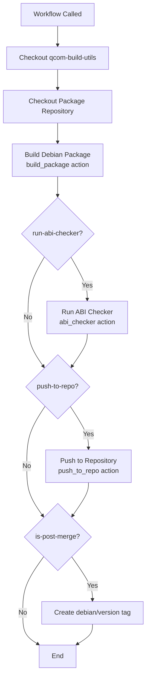
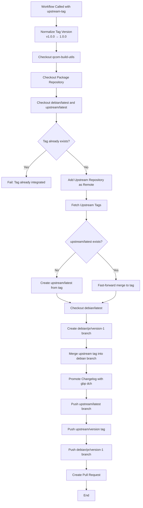
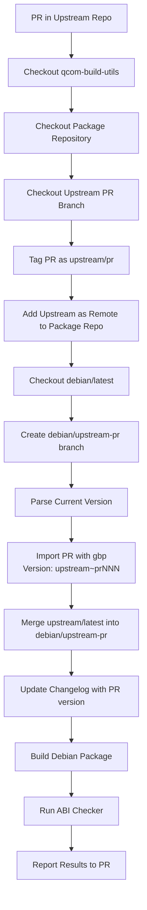
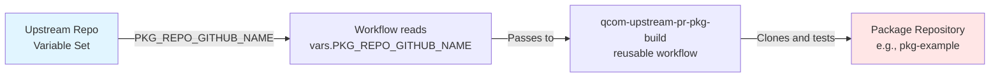
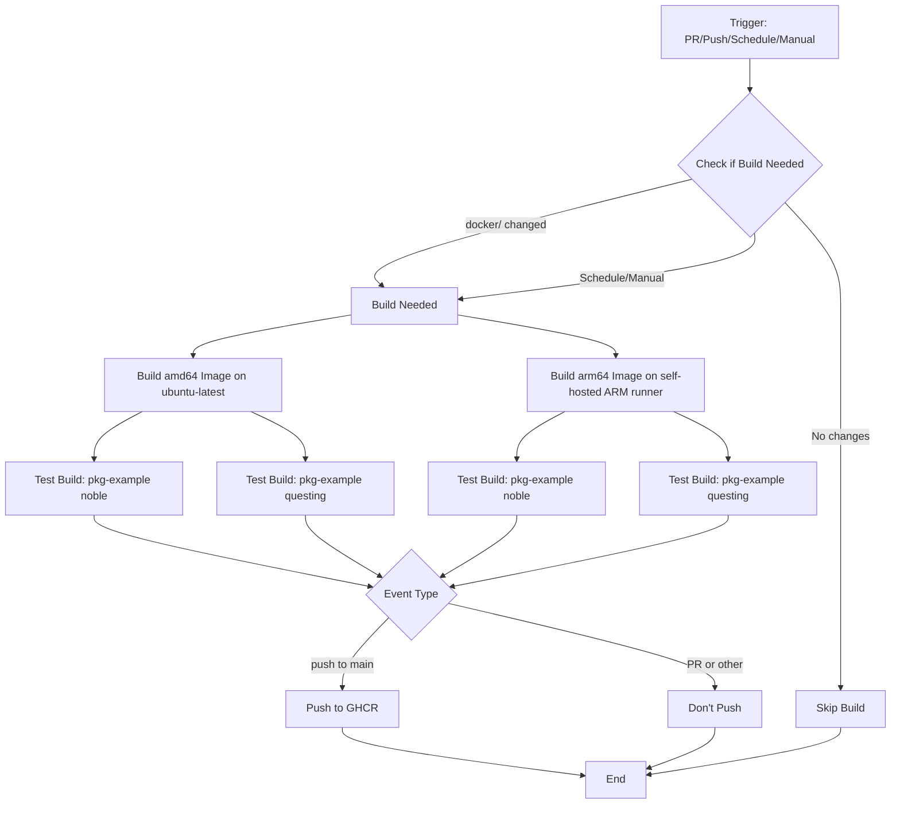
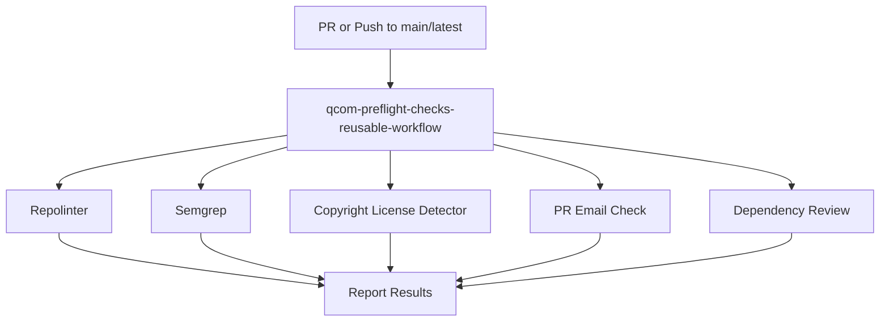

# Reusable Workflows

This document provides detailed information about each reusable workflow in qcom-build-utils.

## Overview

Reusable workflows are defined in `.github/workflows/` and are designed to be called from package repositories. They orchestrate the build, test, and deployment process for Debian packages.

## Available Workflows

1. [qcom-build-pkg-reusable-workflow](#qcom-build-pkg-reusable-workflow)
2. [qcom-promote-upstream-reusable-workflow](#qcom-promote-upstream-reusable-workflow)
3. [qcom-upstream-pr-pkg-build-reusable-workflow](#qcom-upstream-pr-pkg-build-reusable-workflow)
4. [qcom-container-build-and-upload](#qcom-container-build-and-upload)
5. [qcom-preflight-checks](#qcom-preflight-checks)

---

## qcom-build-pkg-reusable-workflow

**File**: `.github/workflows/qcom-build-pkg-reusable-workflow.yml`

**Purpose**: The main workflow for building Debian packages from package repositories. This workflow is called by both pre-merge and post-merge workflows in package repositories.

### Workflow Diagram



### Inputs

| Parameter | Type | Required | Default | Description |
|-----------|------|----------|---------|-------------|
| `qcom-build-utils-ref` | string | Yes | - | The ref (branch/tag) of qcom-build-utils to use |
| `debian-ref` | string | Yes | `debian/latest` | The debian branch/tag to build |
| `distro-codename` | string | No | `noble` | Ubuntu distribution codename (noble, jammy, questing, etc.) |
| `run-lintian` | boolean | No | `false` | Whether to run lintian during build |
| `run-abi-checker` | boolean | No | `false` | Whether to check ABI compatibility |
| `push-to-repo` | boolean | No | `false` | Whether to push built package to repository |
| `is-post-merge` | boolean | No | `false` | True if triggered by merge to debian/latest |
| `runner` | string | No | `lecore-prd-u2404-arm64-xlrg-od-ephem` | GitHub runner to use |

### Secrets

| Secret | Description |
|--------|-------------|
| `TOKEN` | GitHub PAT token for authentication |

### Environment Variables

- `REPO_URL`: `https://qualcomm-linux.github.io/pkg-oss-staging-repo/`
- `REPO_NAME`: `qualcomm-linux/pkg-oss-staging-repo`

### Workflow Steps

1. **Checkout qcom-build-utils**: Sparse checkout of `.github` and `scripts` directories
2. **Checkout Package Repository**: Full checkout with tags for version information
3. **Build Debian Package**: Uses `build_package` composite action
4. **Run ABI Checker** (conditional): Compares ABI with repository version
5. **Push to Repository** (conditional): Uploads package to staging repository
6. **Tag Version** (post-merge only): Creates `debian/{version}` git tag

### Usage Examples

#### Pre-merge (PR) Build

```yaml
jobs:
  build:
    uses: qualcomm-linux/qcom-build-utils/.github/workflows/qcom-build-pkg-reusable-workflow.yml@development
    with:
      qcom-build-utils-ref: development
      debian-ref: ${{github.head_ref}}
      run-abi-checker: true
      push-to-repo: false
      is-post-merge: false
    secrets:
      TOKEN: ${{secrets.DEB_PKG_BOT_CI_TOKEN}}
```

#### Post-merge Build and Publish

```yaml
jobs:
  build:
    uses: qualcomm-linux/qcom-build-utils/.github/workflows/qcom-build-pkg-reusable-workflow.yml@development
    with:
      qcom-build-utils-ref: development
      debian-ref: debian/latest
      push-to-repo: true
      run-abi-checker: true
      is-post-merge: true
    secrets:
      TOKEN: ${{secrets.DEB_PKG_BOT_CI_TOKEN}}
```

---

## qcom-promote-upstream-reusable-workflow

**File**: `.github/workflows/qcom-promote-upstream-reusable-workflow.yml`

**Purpose**: Automates the promotion of a new upstream version into the package repository. This workflow imports an upstream tag, merges it into the packaging branch, and creates a PR for review.

### Workflow Diagram



### Inputs

| Parameter | Type | Required | Default | Description |
|-----------|------|----------|---------|-------------|
| `qcom-build-utils-ref` | string | Yes | - | The ref of qcom-build-utils to use |
| `upstream-tag` | string | Yes | - | The tag in upstream repo to promote (e.g., `v1.0.0`) |
| `upstream-repo` | string | Yes | - | The upstream git repository address (e.g., `org/repo`) |
| `promote-changelog` | boolean | No | `false` | Whether to run gbp dch to update changelog |

### Secrets

| Secret | Description |
|--------|-------------|
| `TOKEN` | GitHub PAT token for authentication |

### Environment Variables

- `NORMALIZED_VERSION`: Version with 'v' prefix removed
- `DISTRIBUTION`: Target distribution (default: `noble`)

### Workflow Steps

1. **Normalize Tag Version**: Remove 'v' prefix from version tag
2. **Checkout Repositories**: Clone qcom-build-utils and package repository
3. **Validate Tag**: Ensure tag doesn't already exist in the package repo
4. **Add Upstream Remote**: Configure upstream repository as git remote
5. **Fetch Upstream Tags**: Get all tags from upstream
6. **Pre-populate upstream/latest**: Create or fast-forward upstream/latest branch
7. **Merge Upstream**: Create PR branch and merge upstream tag
8. **Promote Changelog**: Update debian/changelog with new version
9. **Push Branches and Tags**: Push upstream/latest and PR branch
10. **Create PR**: Open pull request for manual review

### Usage Example

```yaml
jobs:
  promote:
    uses: qualcomm-linux/qcom-build-utils/.github/workflows/qcom-promote-upstream-reusable-workflow.yml@development
    with:
      qcom-build-utils-ref: development
      upstream-tag: v2.1.0
      upstream-repo: qualcomm-linux/my-upstream-project
      promote-changelog: true
    secrets:
      TOKEN: ${{secrets.DEB_PKG_BOT_CI_TOKEN}}
```

### Notes

- Creates a PR branch: `debian/pr/{version}-1`
- Creates an upstream tag: `upstream/{version}`
- Automatically updates the changelog
- PR must be reviewed and merged manually
- Uses git-buildpackage (gbp) tools for Debian packaging operations

---

## qcom-upstream-pr-pkg-build-reusable-workflow

**File**: `.github/workflows/qcom-upstream-pr-pkg-build-reusable-workflow.yml`

**Purpose**: Validates that upstream repository pull requests don't break the Debian package build. This workflow is called from the upstream repository's PR workflow.

### Workflow Diagram



### Inputs

| Parameter | Type | Required | Default | Description |
|-----------|------|----------|---------|-------------|
| `qcom-build-utils-ref` | string | Yes | - | The ref of qcom-build-utils to use |
| `upstream-repo` | string | Yes | - | The upstream repository triggering the workflow |
| `upstream-repo-ref` | string | Yes | - | The ref (PR branch) in upstream repo |
| `pkg-repo` | string | Yes | - | The package repository to test against |
| `pr-number` | number | Yes | - | The PR number in upstream repo |
| `run-lintian` | boolean | No | `false` | Whether to run lintian |
| `distro-codename` | string | No | `noble` | Distribution codename |
| `runner` | string | No | `ubuntu-latest` | Runner to use |

### Secrets

| Secret | Description |
|--------|-------------|
| `TOKEN` | GitHub PAT token for authentication |

### Environment Variables

- `REPO_URL`: APT repository URL for ABI checking
- `upstream_version`: Extracted upstream version from changelog
- `distro_revision`: Extracted distribution revision from changelog

### Workflow Steps

1. **Checkout Repositories**: Clone qcom-build-utils, package repo, and upstream PR
2. **Tag Upstream PR**: Create `upstream/pr` tag on the PR branch
3. **Add Remote**: Add upstream repo as remote to package repo
4. **Merge PR Changes**: Create test branch and merge PR into debian/latest
5. **Version Manipulation**: Create special version with `~pr{number}` suffix
6. **Import with gbp**: Use git-buildpackage to import the PR
7. **Promote Changelog**: Update changelog for test build
8. **Build Package**: Build the package with PR changes
9. **Run ABI Check**: Verify ABI compatibility
10. **Report Status**: Return success/failure to the upstream PR

### Usage Example

Called from upstream repository's workflow (e.g., `.github/workflows/pkg-build-pr-check.yml`):

```yaml
name: Package Build PR Check

on:
  pull_request_target:
    branches: [ main ]

jobs:
  package-build-pr-check:
    uses: qualcomm-linux/qcom-build-utils/.github/workflows/qcom-upstream-pr-pkg-build-reusable-workflow.yml@development
    with:
      qcom-build-utils-ref: development
      upstream-repo: ${{github.repository}}
      upstream-repo-ref: ${{github.head_ref}}
      pkg-repo: ${{vars.PKG_REPO_GITHUB_NAME}}
      pr-number: ${{github.event.pull_request.number}}
    secrets:
      TOKEN: ${{secrets.DEB_PKG_BOT_CI_TOKEN}}
```

**Setup Requirements**:

The `PKG_REPO_GITHUB_NAME` variable is the key to linking upstream and package repositories:

1. **Configure in upstream repository**: Go to Settings → Secrets and variables → Actions → Variables
2. **Create variable**:
   - **Name**: `PKG_REPO_GITHUB_NAME`
   - **Value**: Package repository in format `organization/repo-name` (e.g., `qualcomm-linux/pkg-example`)
3. **Use in workflow**: Reference as `${{vars.PKG_REPO_GITHUB_NAME}}` in the `pkg-repo` parameter



**Example**: See [qcom-example-package-source](https://github.com/qualcomm-linux/qcom-example-package-source) for a complete example

### Notes

- Creates special version with `~pr{number}` to indicate test build
- The `~` character ensures version sorts lower than release versions
- Filters out `.git`, `.github`, and `debian` folders from upstream
- Does not push built packages to repository
- Only validates that the build succeeds

---

## qcom-container-build-and-upload

**File**: `.github/workflows/qcom-container-build-and-upload.yml`

**Purpose**: Builds and publishes the Docker container images used for building Debian packages. These containers include all necessary tools and dependencies.

### Workflow Diagram



### Triggers

- **Schedule**: Monday at 00:00 UTC (weekly rebuild)
- **Pull Request**: On PRs to `main` or `development` branches
- **Push**: On push to `main` branch
- **Manual**: Via `workflow_dispatch`

### Environment Variables

- `QCOM_ORG_NAME`: `qualcomm-linux`
- `IMAGE_NAME`: `pkg-builder`

### Jobs

#### check-if-build-needed

Determines whether container rebuild is necessary:

- **For PRs**: Check if `docker/` folder changed
- **For Pushes**: Check if `.github/docker/` folder changed
- **For Schedule/Manual**: Always build

#### build-image-amd64

- Runs on: `ubuntu-latest` (x86_64)
- Builds: `amd64` container images natively
- Tests: Builds `pkg-example` for noble and questing
- Pushes: Only on non-PR events

#### build-image-arm64

- Runs on: `["self-hosted", "lecore-prd-u2404-arm64-xlrg-od-ephem"]`
- Builds: `arm64` container images natively
- Tests: Builds `pkg-example` for noble and questing
- Pushes: Only on non-PR events

### Container Images

Built images are tagged as:
- `ghcr.io/qualcomm-linux/pkg-builder:amd64-noble`
- `ghcr.io/qualcomm-linux/pkg-builder:amd64-questing`
- `ghcr.io/qualcomm-linux/pkg-builder:arm64-noble`
- `ghcr.io/qualcomm-linux/pkg-builder:arm64-questing`

### Notes

- Cross-compilation using QEMU was attempted but had reliability issues
- Native builds on appropriate architecture runners are used instead
- Images include all tools for Debian package building (sbuild, gbp, etc.)
- Test builds with `pkg-example` ensure container functionality before publishing

---

## qcom-preflight-checks

**File**: `.github/workflows/qcom-preflight-checks.yml`

**Purpose**: Runs security and quality checks on the qcom-build-utils repository itself. This workflow uses Qualcomm's centralized preflight checks.

### Workflow Diagram



### Triggers

- **Pull Request**: On PRs to `main` or `latest` branches
- **Push**: On push to `main` or `latest` branches
- **Manual**: Via `workflow_dispatch`

### Checks Enabled

| Check | Purpose |
|-------|---------|
| `repolinter` | Validates repository structure and required files |
| `semgrep` | Static analysis for security vulnerabilities |
| `copyright-license-detector` | Verifies license headers and compliance |
| `pr-check-emails` | Validates commit author emails |
| `dependency-review` | Checks for vulnerable dependencies in PRs |

### Secrets

| Secret | Description |
|--------|-------------|
| `SEMGREP_APP_TOKEN` | Token for Semgrep security scanning |

### Notes

- Uses external reusable workflow from `qualcomm/qcom-reusable-workflows`
- Version pinned to `v1.1.4` for stability
- All checks are enabled by default
- Security scanning results are written to security events

---

## Common Patterns

### Calling Reusable Workflows

All reusable workflows are called using the same pattern:

```yaml
jobs:
  job-name:
    uses: qualcomm-linux/qcom-build-utils/.github/workflows/{workflow-name}.yml@{ref}
    with:
      # Input parameters
      qcom-build-utils-ref: development
      # ... other inputs
    secrets:
      TOKEN: ${{secrets.DEB_PKG_BOT_CI_TOKEN}}
```

### Required Organization Secrets

Package repositories need these organization secrets configured:

- `DEB_PKG_BOT_CI_TOKEN` - GitHub PAT for authentication
- `SEMGREP_APP_TOKEN` - For security scanning

### Required Organization Variables

- `DEB_PKG_BOT_CI_USERNAME` - Username for container registry
- `DEB_PKG_BOT_CI_NAME` - Name for git commits
- `DEB_PKG_BOT_CI_EMAIL` - Email for git commits

## Best Practices

1. **Pin workflow versions**: Use specific refs (tags or commit SHAs) for production
2. **Use development ref for testing**: Test changes with `@development` ref
3. **Enable ABI checking**: Always run ABI checker in pre-merge and post-merge
4. **Test before pushing**: Use `push-to-repo: false` for pre-merge builds
5. **Review automation**: Even automated PRs should be reviewed before merging
