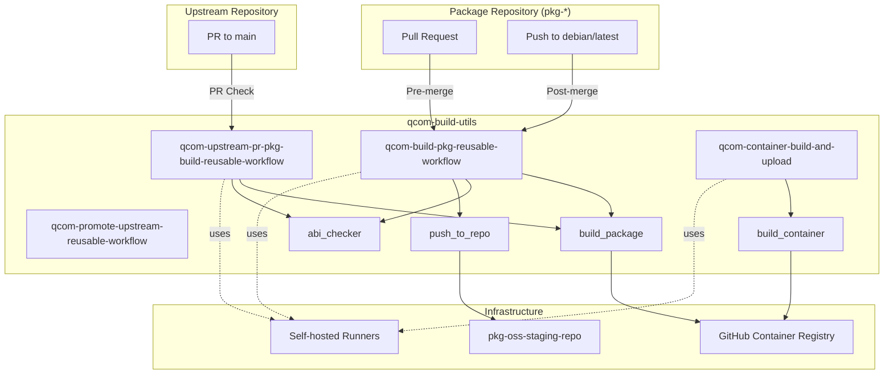
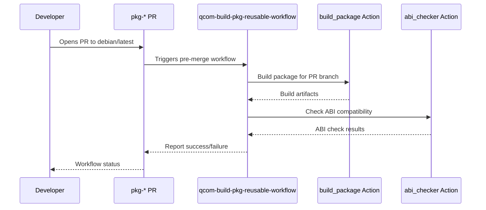
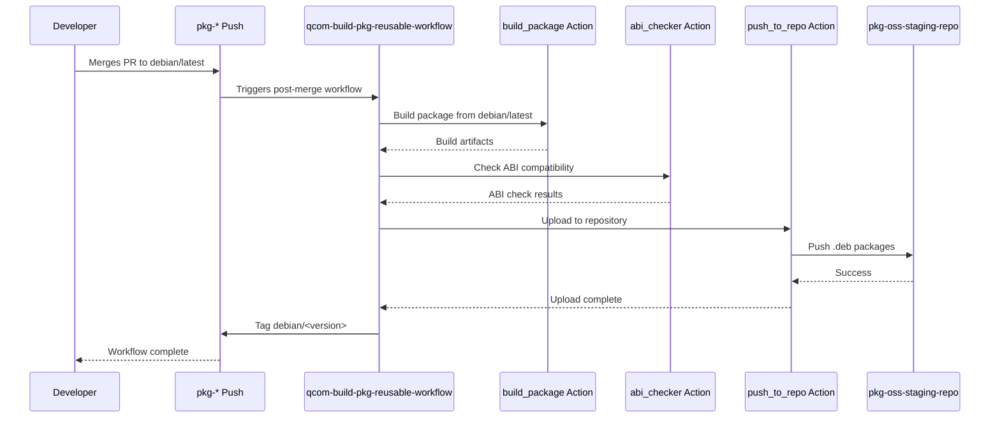
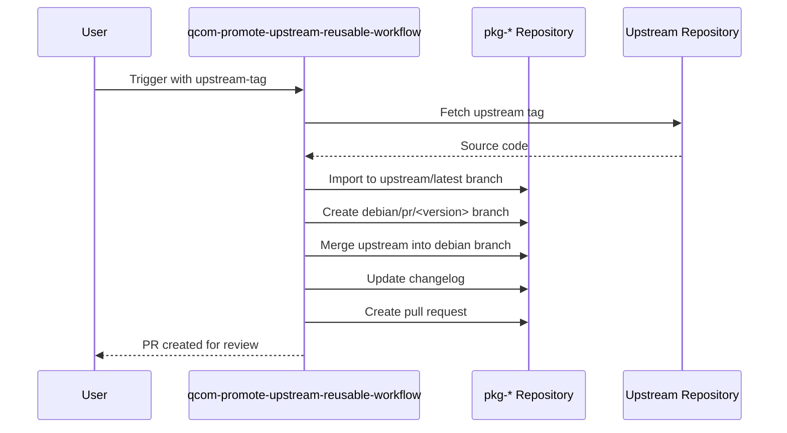
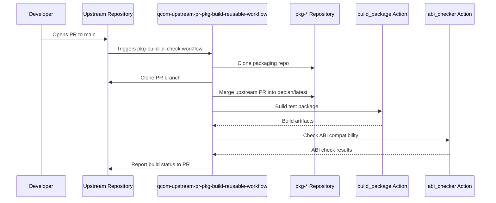
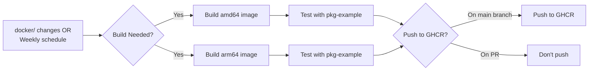

# Workflow Architecture

This document provides a high-level overview of the qcom-build-utils workflow architecture and how it integrates with Debian package repositories.

## System Overview

The qcom-build-utils workflow system consists of four main components:

1. **Upstream Repositories** - Source code repositories for projects (e.g., qcom-example-package-source)
2. **Package Repositories (pkg-*)** - Debian packaging repositories that track upstream projects
3. **qcom-build-utils Repository** - Centralized workflow and action definitions
4. **Build Infrastructure** - Container images, runners, and artifact storage



## Component Responsibilities

### 1. Upstream Repositories

**Purpose**: Source code repositories for projects that are packaged as Debian packages.

**Example**: [qcom-example-package-source](https://github.com/qualcomm-linux/qcom-example-package-source)

**Structure**:
```
qcom-example-package-source/
├── .github/
│   └── workflows/
│       └── pkg-build-pr-check.yml  # Validates PRs don't break package
├── src/                            # Source code
├── include/                        # Headers
├── Makefile                        # Build system
└── README.md
```

**Responsibilities**:
- Maintain the actual project source code
- Implement project-specific features and fixes
- Tag releases for package promotion
- Optionally validate that PRs don't break the Debian package build

**Package Integration**:
Upstream repositories can include a workflow (e.g., `pkg-build-pr-check.yml`) that calls `qcom-upstream-pr-pkg-build-reusable-workflow` to ensure PRs don't break the package build. This workflow requires setting a repository variable `PKG_REPO_GITHUB_NAME` pointing to the associated package repository.

#### Repository Variable Linking

The connection between an upstream repository and its package repository is established via the `PKG_REPO_GITHUB_NAME` repository variable:

```mermaid
graph LR
    subgraph "Upstream Repository"
        UP[qcom-example-package-source]
        UPVAR["Repository Variable:<br/>PKG_REPO_GITHUB_NAME<br/>= 'qualcomm-linux/pkg-example'"]
        UPWF[.github/workflows/<br/>pkg-build-pr-check.yml]
    end
    
    subgraph "Package Repository"
        PKG[pkg-example]
        PKGWF[.github/workflows/<br/>pre-merge.yml<br/>post-merge.yml]
    end
    
    UP --> UPVAR
    UPVAR -.references.-> PKG
    UPWF -->|uses ${{vars.PKG_REPO_GITHUB_NAME}}| PKG
    
    style UPVAR fill:#e1f5ff
```

**Key Points**:
- The `PKG_REPO_GITHUB_NAME` variable is set in the **upstream repository's** GitHub settings
- Value format: `organization/repository` (e.g., `qualcomm-linux/pkg-example`)
- The upstream workflow uses `${{vars.PKG_REPO_GITHUB_NAME}}` to reference the package repository
- This creates a dynamic link allowing the upstream repo to validate changes against its package build

### 2. qcom-build-utils Repository

**Purpose**: Provides centralized, reusable workflow definitions and composite actions for building Debian packages.

**Key Files**:
- `.github/workflows/` - Reusable workflow definitions
- `.github/actions/` - Composite action definitions
- `scripts/` - Build and utility scripts
- `docker/` - Dockerfiles for build containers

**Responsibilities**:
- Define reusable workflows for package building, testing, and promotion
- Provide composite actions for modular build steps
- Maintain build container images
- Host shared build scripts and utilities

### 3. Package Repositories (pkg-*)

**Purpose**: Individual repositories containing Debian packaging metadata and source code for specific packages.

**Naming Convention**: Repositories follow the `pkg-` prefix convention (e.g., `pkg-example`, `pkg-mypackage`)

**Git Structure**:
```
pkg-mypackage/
├── debian/              # Debian packaging files
│   ├── changelog
│   ├── control
│   ├── rules
│   └── ...
├── .github/
│   └── workflows/
│       ├── pre-merge.yml    # Calls qcom-build-pkg-reusable-workflow
│       └── post-merge.yml   # Calls qcom-build-pkg-reusable-workflow
├── src/                 # Source code (for native packages)
└── ...
```

**Branch Structure**:
- `main` - Primary development branch
- `debian/latest` - Latest Debian packaging branch (build target)
- `debian/<version>` - Specific version branches
- `upstream/latest` - Latest upstream source code (for non-native packages)
- `upstream/<version>` - Specific upstream version tags

**Responsibilities**:
- Maintain Debian packaging metadata
- Define minimal workflow callers that invoke qcom-build-utils reusable workflows
- Follow git-buildpackage structure
- Manage package-specific build configurations

### 4. Build Infrastructure

**Components**:

#### GitHub Container Registry (GHCR)
- Hosts pre-built container images for building packages
- Images: `ghcr.io/qualcomm-linux/pkg-builder:{arch}-{distro}`
- Architectures: `amd64`, `arm64`
- Distributions: `noble`, `questing`

#### pkg-oss-staging-repo
- APT repository for hosting built Debian packages
- URL: `https://qualcomm-linux.github.io/pkg-oss-staging-repo/`
- Structure: `pool/{distro}/stable/main/`

#### Self-hosted Runners
- ARM64 runners for native ARM builds
- Runner tags: `lecore-prd-u2404-arm64-xlrg-od-ephem`

## Workflow Integration Flow

### Pre-merge Flow (Pull Requests)

When a pull request is opened against `debian/latest` in a package repository:



**Workflow Configuration** (in pkg-*/. github/workflows/pre-merge.yml):
```yaml
on:
  pull_request_target:
    branches: [ debian/latest ]

jobs:
  build:
    uses: qualcomm-linux/qcom-build-utils/.github/workflows/qcom-build-pkg-reusable-workflow.yml@development
    with:
      qcom-build-utils-ref: development
      debian-ref: ${{github.head_ref}}
      run-abi-checker: true
      push-to-repo: false
      is-post-merge: false
```

### Post-merge Flow (Merged PRs)

When a PR is merged to `debian/latest`:



**Workflow Configuration** (in pkg-*/.github/workflows/post-merge.yml):
```yaml
on:
  push:
    branches: [ debian/latest ]

jobs:
  build:
    uses: qualcomm-linux/qcom-build-utils/.github/workflows/qcom-build-pkg-reusable-workflow.yml@development
    with:
      qcom-build-utils-ref: development
      debian-ref: debian/latest
      push-to-repo: true
      run-abi-checker: true
      is-post-merge: true
```

### Upstream Promotion Flow

When promoting a new upstream version to the package repository:



### Upstream PR Validation Flow

When a PR is opened in an upstream repository (e.g., qcom-example-package-source), an optional workflow can validate that the changes don't break the Debian package build:



**Setup Requirements**:
- Upstream repository must have a workflow file (e.g., `.github/workflows/pkg-build-pr-check.yml`)
- Repository variable `PKG_REPO_GITHUB_NAME` must be set to the associated package repository name
  - **Location**: Set in upstream repository → Settings → Secrets and variables → Actions → Variables
  - **Format**: `organization/repository-name` (e.g., `qualcomm-linux/pkg-example`)
  - **Usage**: Referenced in workflow as `${{vars.PKG_REPO_GITHUB_NAME}}`
- Example: [qcom-example-package-source](https://github.com/qualcomm-linux/qcom-example-package-source)

**Workflow Configuration**:
The upstream repository's workflow uses the variable to dynamically reference its package repository:

```yaml
jobs:
  package-build-pr-check:
    uses: qualcomm-linux/qcom-build-utils/.github/workflows/qcom-upstream-pr-pkg-build-reusable-workflow.yml@development
    with:
      upstream-repo: ${{github.repository}}
      upstream-repo-ref: ${{github.head_ref}}
      pkg-repo: ${{vars.PKG_REPO_GITHUB_NAME}}  # Links to package repo
      pr-number: ${{github.event.pull_request.number}}
```

## Container Build and Maintenance

The build containers are maintained separately and rebuilt:



**Key Points**:
- Containers are rebuilt weekly (Monday at 00:00 UTC)
- Containers are rebuilt when `docker/` directory changes
- Both `amd64` and `arm64` variants are built
- Images are tested by building `pkg-example` before publishing
- Images are only pushed to GHCR from `main` branch, not from PRs

## Key Design Principles

1. **Centralization**: Workflow logic is centralized in qcom-build-utils to ensure consistency
2. **Reusability**: Package repositories only need minimal workflow callers
3. **Flexibility**: Workflows support various configurations through input parameters
4. **Security**: Uses organization secrets and restricted permissions
5. **Isolation**: Each package repository is independent
6. **Automation**: Automated building, testing, versioning, and publishing

## Security Considerations

- Workflows use `pull_request_target` for secure PR builds
- Container credentials stored as organization secrets
- Repository access controlled via GitHub PAT tokens
- ABI checking prevents accidental API/ABI breakage
- CodeQL and security scanning via qcom-preflight-checks
