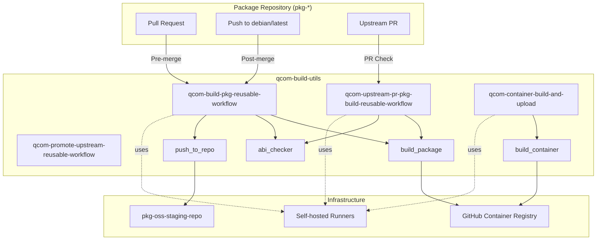
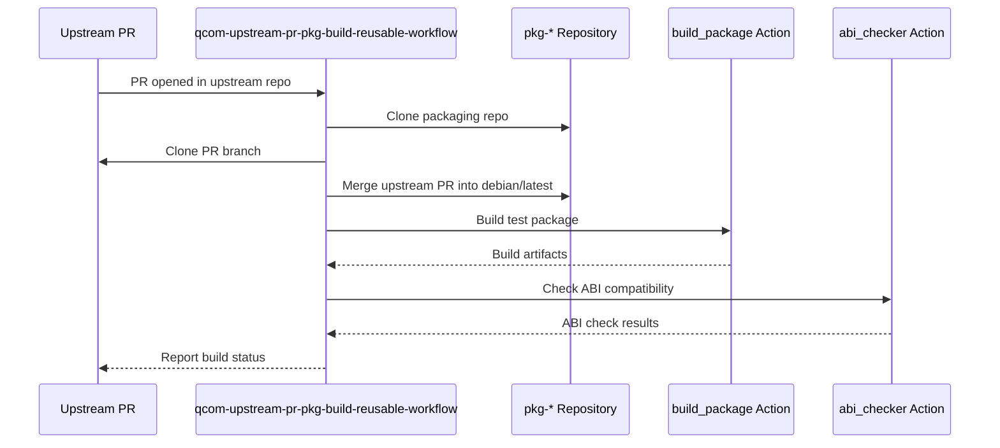

# Workflow Architecture

This document provides a high-level overview of the qcom-build-utils workflow architecture and how it integrates with Debian package repositories.

## System Overview

The qcom-build-utils workflow system consists of three main components:

1. **qcom-build-utils Repository** - Centralized workflow and action definitions
2. **Package Repositories (pkg-*)** - Individual Debian packaging repositories
3. **Build Infrastructure** - Container images, runners, and artifact storage



## Component Responsibilities

### 1. qcom-build-utils Repository

**Purpose**: Provides centralized, reusable workflow definitions and composite actions for building Debian packages.

**Key Files**:
- `.github/workflows/` - Reusable workflow definitions
- `.github/actions/` - Composite action definitions
- `scripts/` - Build and utility scripts
- `docker/` - Dockerfiles for build containers

**Responsibilities**:
- Define reusable workflows for package building, testing, and promotion
- Provide composite actions for modular build steps
- Maintain build container images
- Host shared build scripts and utilities

### 2. Package Repositories (pkg-*)

**Purpose**: Individual repositories containing Debian packaging metadata and source code for specific packages.

**Naming Convention**: Repositories follow the `pkg-` prefix convention (e.g., `pkg-example`, `pkg-mypackage`)

**Git Structure**:
```
pkg-mypackage/
├── debian/              # Debian packaging files
│   ├── changelog
│   ├── control
│   ├── rules
│   └── ...
├── .github/
│   └── workflows/
│       ├── pre-merge.yml    # Calls qcom-build-pkg-reusable-workflow
│       └── post-merge.yml   # Calls qcom-build-pkg-reusable-workflow
├── src/                 # Source code (for native packages)
└── ...
```

**Branch Structure**:
- `main` - Primary development branch
- `debian/latest` - Latest Debian packaging branch (build target)
- `debian/<version>` - Specific version branches
- `upstream/latest` - Latest upstream source code (for non-native packages)
- `upstream/<version>` - Specific upstream version tags

**Responsibilities**:
- Maintain Debian packaging metadata
- Define minimal workflow callers that invoke qcom-build-utils reusable workflows
- Follow git-buildpackage structure
- Manage package-specific build configurations

### 3. Build Infrastructure

**Components**:

#### GitHub Container Registry (GHCR)
- Hosts pre-built container images for building packages
- Images: `ghcr.io/qualcomm-linux/pkg-builder:{arch}-{distro}`
- Architectures: `amd64`, `arm64`
- Distributions: `noble`, `questing`

#### pkg-oss-staging-repo
- APT repository for hosting built Debian packages
- URL: `https://qualcomm-linux.github.io/pkg-oss-staging-repo/`
- Structure: `pool/{distro}/stable/main/`

#### Self-hosted Runners
- ARM64 runners for native ARM builds
- Runner tags: `lecore-prd-u2404-arm64-xlrg-od-ephem`

## Workflow Integration Flow

### Pre-merge Flow (Pull Requests)

When a pull request is opened against `debian/latest` in a package repository:


**Workflow Configuration** (in pkg-*/. github/workflows/pre-merge.yml):
```yaml
on:
  pull_request_target:
    branches: [ debian/latest ]

jobs:
  build:
    uses: qualcomm-linux/qcom-build-utils/.github/workflows/qcom-build-pkg-reusable-workflow.yml@development
    with:
      qcom-build-utils-ref: development
      debian-ref: ${{github.head_ref}}
      run-abi-checker: true
      push-to-repo: false
      is-post-merge: false
```

### Post-merge Flow (Merged PRs)

When a PR is merged to `debian/latest`:


**Workflow Configuration** (in pkg-*/.github/workflows/post-merge.yml):
```yaml
on:
  push:
    branches: [ debian/latest ]

jobs:
  build:
    uses: qualcomm-linux/qcom-build-utils/.github/workflows/qcom-build-pkg-reusable-workflow.yml@development
    with:
      qcom-build-utils-ref: development
      debian-ref: debian/latest
      push-to-repo: true
      run-abi-checker: true
      is-post-merge: true
```

### Upstream Promotion Flow

When promoting a new upstream version to the package repository:


### Upstream PR Validation Flow

When an upstream repository opens a PR that affects the package:



## Container Build and Maintenance

The build containers are maintained separately and rebuilt:


**Key Points**:
- Containers are rebuilt weekly (Monday at 00:00 UTC)
- Containers are rebuilt when `docker/` directory changes
- Both `amd64` and `arm64` variants are built
- Images are tested by building `pkg-example` before publishing
- Images are only pushed to GHCR from `main` branch, not from PRs

## Key Design Principles

1. **Centralization**: Workflow logic is centralized in qcom-build-utils to ensure consistency
2. **Reusability**: Package repositories only need minimal workflow callers
3. **Flexibility**: Workflows support various configurations through input parameters
4. **Security**: Uses organization secrets and restricted permissions
5. **Isolation**: Each package repository is independent
6. **Automation**: Automated building, testing, versioning, and publishing

## Security Considerations

- Workflows use `pull_request_target` for secure PR builds
- Container credentials stored as organization secrets
- Repository access controlled via GitHub PAT tokens
- ABI checking prevents accidental API/ABI breakage
- CodeQL and security scanning via qcom-preflight-checks
